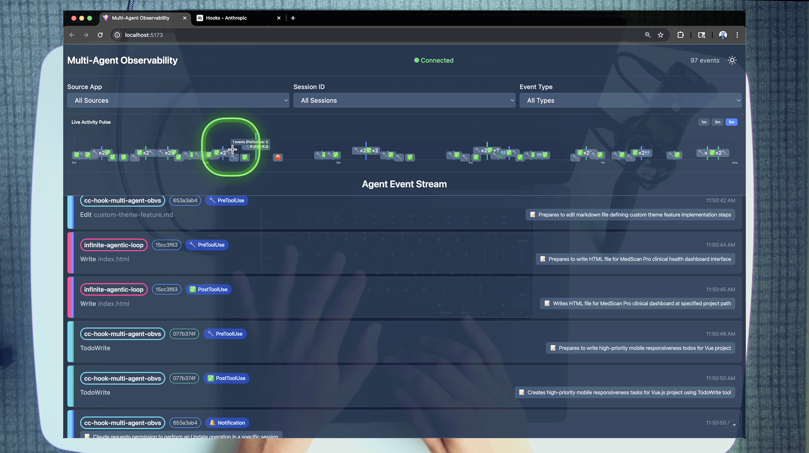
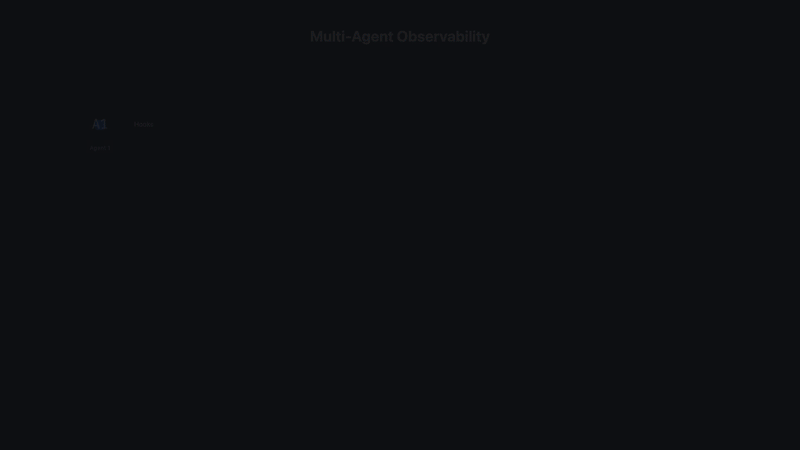

# Multi-Agent Observability System

Real-time monitoring and visualization for Claude Code agents through comprehensive hook event tracking.

## 🎯 Overview

This system provides complete observability into Claude Code agent behavior by capturing, storing, and visualizing Claude Code [Hook events](https://docs.anthropic.com/en/docs/claude-code/hooks) in real-time. It enables monitoring of multiple concurrent agents with session tracking, event filtering, and live updates.



## 📋 Prerequisites

- **[Claude Code](https://docs.anthropic.com/en/docs/claude-code)** - Anthropic's official CLI for Claude
- **[Astral uv](https://docs.astral.sh/uv/)** - Fast Python package manager (required for hook scripts)
- **[Bun](https://bun.sh/)** and **npm** - For running the server and client
- **Python 3.8+** - For hook scripts
- **Anthropic API Key** - Required for Claude Code functionality
- **OpenAI API Key** - Optional for multi-model support
- **ElevenLabs API Key** - Optional for audio features

## 🚀 One-line Bootstrap

```bash
./scripts/start_env.sh
```

This command will:
- Create and activate a Python virtual environment
- Load environment variables from `.env` file
- Install required dependencies
- Start the development environment with tmux

## 🔑 How to Set/Change API Keys

1. Copy the sample environment file:
   ```bash
   cp .env.sample .env
   ```

2. Edit `.env` with your API keys:
   ```bash
   ANTHROPIC_API_KEY=your_actual_key_here
   OPENAI_API_KEY=optional_key_here
   ELEVENLABS_API_KEY=optional_key_here
   ENGINEER_NAME=Your Name
   ```

3. Keys will be automatically loaded when you run `./scripts/start_env.sh`

## 🔄 Updating Dependencies

### JavaScript/TypeScript Dependencies
```bash
# Update all npm packages
npm update

# Update client dependencies
npm update --prefix apps/client

# Update server dependencies
npm update --prefix apps/server
```

### Python Dependencies
```bash
# Using pip-compile (if you have pip-tools installed)
pip-compile --upgrade

# Or using regular pip
pip install --upgrade pip
pip install --upgrade pyyaml requests python-dotenv watchdog
```

## ❓ Troubleshooting FAQ

### Common Issues

**Q: Virtual environment not activating**
- Ensure Python 3.8+ is installed
- Check that the virtual environment exists in the project root
- Run `python3 -m venv venv` if it doesn't exist

**Q: Hook scripts not executing**
- Make sure `uv` is installed: `pip install uv`
- Verify paths in `.claude/settings.json` are absolute
- Run `/convert_paths_absolute` in Claude Code to fix paths

**Q: Server won't start**
- Check if port 4000 is available: `lsof -i :4000`
- Ensure Bun is installed and up to date: `bun --version`
- Verify all dependencies are installed: `npm install --prefix apps/server`

**Q: Client won't start**
- Check if port 5173 is available: `lsof -i :5173`
- Run `npm install --prefix apps/client` to install dependencies
- Make sure Node.js 18+ is installed: `node --version`

**Q: API keys not working**
- Verify `.env` file is in the project root
- Check that keys are properly formatted (no quotes needed)
- Ensure the `.env` file is not committed to git
- Restart the application after changing keys

**Q: WebSocket connection issues**
- Verify the server is running on port 4000
- Check browser console for connection errors
- Ensure no firewall is blocking WebSocket connections
- Try refreshing the browser page

**Q: tmux session issues**
- Install tmux if not available: `brew install tmux` (macOS) or `apt-get install tmux` (Linux)
- Kill existing sessions: `tmux kill-session -t claude-dev-env`
- Use `--no-tmux` flag to skip tmux: `./scripts/start_env.sh --no-tmux`

## 🏗️ Architecture

```
Claude Agents → Hook Scripts → HTTP POST → Bun Server → SQLite → WebSocket → Vue Client
```



## 🚀 Quick Start

1. **Start the system:**
   ```bash
   ./scripts/start_env.sh
   ```

2. **Open the dashboard:**
   Navigate to http://localhost:5173 in your browser

3. **Test with Claude Code:**
   Open Claude Code and run any command to see events appear in real-time

## 📁 Project Structure

```
claude-code-hooks-multi-agent-observability/
│
├── apps/                    # Application components
│   ├── server/             # Bun TypeScript server
│   │   ├── src/
│   │   │   ├── index.ts    # Main server with HTTP/WebSocket endpoints
│   │   │   ├── db.ts       # SQLite database management & migrations
│   │   │   └── types.ts    # TypeScript interfaces
│   │   ├── package.json
│   │   └── events.db       # SQLite database (gitignored)
│   │
│   └── client/             # Vue 3 TypeScript client
│       ├── src/
│       │   ├── App.vue     # Main app with theme & WebSocket management
│       │   ├── components/ # Vue components
│       │   ├── composables/ # Vue composables
│       │   └── types.ts    # TypeScript interfaces
│       ├── .env.sample     # Environment configuration template
│       └── package.json
│
├── .claude/                # Claude Code integration
│   ├── hooks/             # Hook scripts (Python with uv)
│   │   ├── send_event.py  # Universal event sender
│   │   ├── pre_tool_use.py    # Tool validation & blocking
│   │   ├── post_tool_use.py   # Result logging
│   │   ├── notification.py    # User interaction events
│   │   ├── stop.py           # Session completion
│   │   └── subagent_stop.py  # Subagent completion
│   │
│   └── settings.json      # Hook configuration
│
├── scripts/               # Utility scripts
│   ├── start_env.sh      # Unified launcher (venv + env vars + launch_dev_env.py)
│   ├── stop_env.sh       # Unified teardown (tmux + services + cleanup)
│   ├── start-system.sh   # Launch server & client
│   ├── reset-system.sh   # Stop all processes
│   └── test-system.sh    # System validation
│
└── logs/                 # Application logs (gitignored)
```

## 🎨 Event Types & Visualization

| Event Type   | Emoji | Purpose               | Color Coding  |
| ------------ | ----- | --------------------- | ------------- |
| PreToolUse   | 🔧     | Before tool execution | Session-based |
| PostToolUse  | ✅     | After tool completion | Session-based |
| Notification | 🔔     | User interactions     | Session-based |
| Stop         | 🛑     | Response completion   | Session-based |
| SubagentStop | 👥     | Subagent finished     | Session-based |
| PreCompact   | 📦     | Context compaction    | Session-based |

## 🔌 Integration with Other Projects

To integrate this observability system into your own projects:

1. **Copy the `.claude` directory to your project root:**
   ```bash
   cp -R .claude /path/to/your/project/
   ```

2. **Update the `settings.json` configuration:**
   Replace `cc-hooks-observability` with your project name in `.claude/settings.json`

3. **Ensure the observability server is running:**
   ```bash
   ./scripts/start_env.sh
   ```

## 🧪 Testing

```bash
# System validation
./scripts/test-system.sh

# Manual event test
curl -X POST http://localhost:4000/events \
  -H "Content-Type: application/json" \
  -d '{
    "source_app": "test",
    "session_id": "test-123",
    "hook_event_type": "PreToolUse",
    "payload": {"tool_name": "Bash", "tool_input": {"command": "ls"}}
  }'
```

## ⚙️ Configuration

### Environment Variables

Copy `.env.sample` to `.env` in the project root and fill in your API keys:

**Application Root** (`.env` file):
- `ANTHROPIC_API_KEY` – Anthropic Claude API key (required)
- `ENGINEER_NAME` – Your name (for logging/identification)
- `OPENAI_API_KEY` – OpenAI API key (optional)
- `ELEVENLABS_API_KEY` – ElevenLabs API key (optional)

**Client** (`.env` file in `apps/client/.env`):
- `VITE_MAX_EVENTS_TO_DISPLAY=100` – Maximum events to show (removes oldest when exceeded)

### Server Ports

- Server: `4000` (HTTP/WebSocket)
- Client: `5173` (Vite dev server)

## 📊 Technical Stack

- **Server**: Bun, TypeScript, SQLite
- **Client**: Vue 3, TypeScript, Vite, Tailwind CSS
- **Hooks**: Python 3.8+, Astral uv
- **Communication**: HTTP REST, WebSocket

## 🛡️ Security Features

- Blocks dangerous commands (`rm -rf`, etc.)
- Prevents access to sensitive files (`.env`, private keys)
- Validates all inputs before execution
- No external dependencies for core functionality

## 📝 License

MIT License - see LICENSE file for details.
